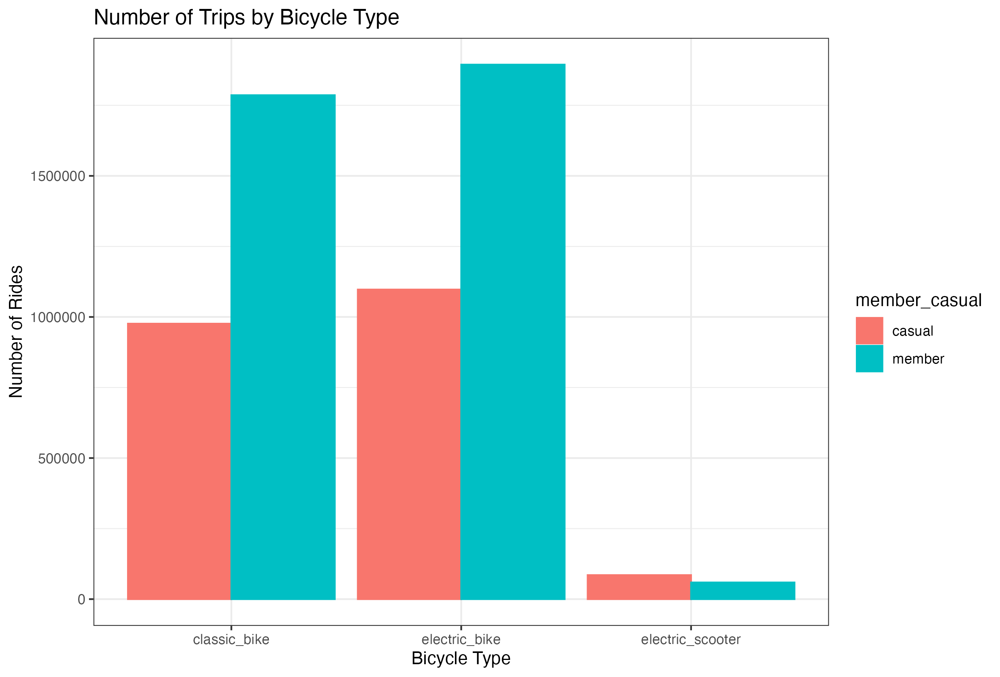
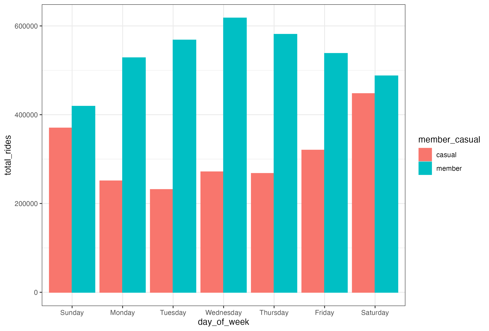
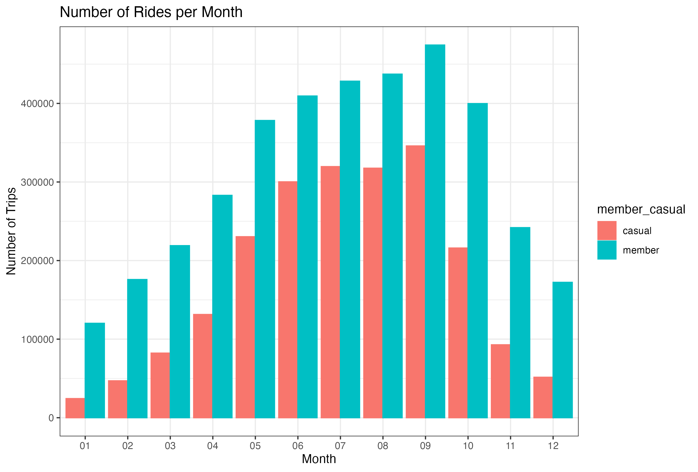

# Cyclistic Bike-Share Analysis
## Project Overview
This project analyzes the Cyclistic bike-share data to identify usage patterns and provide insights into converting casual users into annual members. The analysis is based on data from December 2023 to November 2024.

## Key Objectives
1. Understand the differences in usage between casual riders and annual members.
2. Explore trends in bike usage across different days of the week, months, and bike types.
3. Provide actionable recommendations for Cyclistic's marketing team.

## Data Sources
The data used in this project was provided by [Divvy](https://divvy-tripdata.s3.amazonaws.com/index.html), a bike-share program in Chicago. The dataset includes information about individual rides made in the bike-share system, such as:
- Start and end times of rides
- Start and end station names
- Bike types (e.g., classic, electric)
- User types (casual vs. member)

The data can be accessed at the following link:
- [Divvy Trip Data](https://divvy-tripdata.s3.amazonaws.com/index.html)

## Analysis Steps
The analysis was conducted in RStudio using the following steps:
1. Data Preparation:
   - Combined monthly datasets into a single dataframe.
   - Cleaned data by removing null values, duplicates, and rides with invalid durations.
   - Added calculated columns (e.g., ride length, day of the week).
2. Exploratory Data Analysis (EDA):
   - Examined total rides and average ride lengths by user type and bike type.
   - Analyzed usage patterns by day of the week and month.
   - Identified popular start stations.
3. Visualizations:
   - Created bar charts to visualize ride patterns across various dimensions.

## Visualizations
#### Number of Trips by Bicycle Type

#### Total Rides by Day of the Week

#### Number of Rides per Month

## Findings
1. Bike Usage by Type:
   - Electric bikes are the most used type, especially among members.
   - Casual riders show a higher preference for electric scooters compared to members.
2. Day of the Week Trends:
   - Members use bikes consistently throughout the week, with slightly higher usage on weekdays
   - Casual riders primarily use bikes on weekends.
3. Monthly Trends:
   - Usage peaks in the summer months (June-August), with both casual and member users increasing during this period.
4. Ride Durations:
   - Casual riders tend to have longer ride durations than members.

## Recommendations
1. Target Weekend Promotions:
   - Focus on casual riders with weekend discounts or leisure-focused campaigns.
2. Increase Awareness of Annual Memberships:
   - Highlight the benefits of annual memberships, especially for leisure riders who frequently use bikes on weekends.
3. Seasonal Campaigns:
   - Launch marketing campaigns during peak summer months to maximize conversions.
4. Bike availabilty:
   - Ensure adequate availabilty of electric bikes during weekdays for members.
